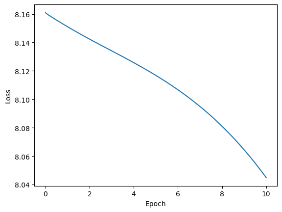

# Word2Vec From Scratch

Just to POC of my knowledge from this paper: https://arxiv.org/pdf/1301.3781

# Model Detail

CBOWModeler(
  (linear1): Linear(in_features=5, out_features=2, bias=False)
  (linear2): Linear(in_features=2, out_features=5, bias=False)
)

# Training Data

"Chihuahua is cute dog"

# Loss Plot

# Result

Chihuahua -> is 
is -> dog 
cute -> EOS 
dog -> is 
EOS -> dog 